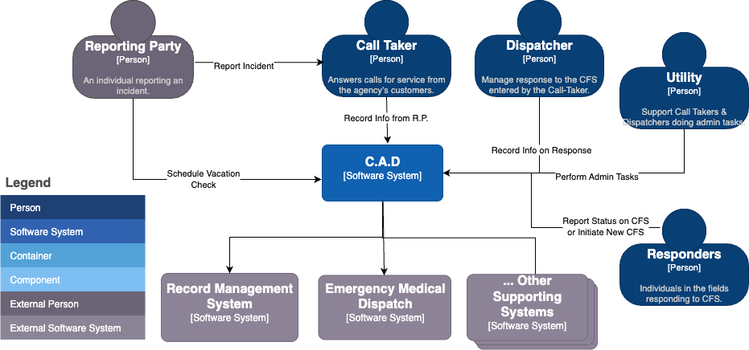

# Computer Aided Dispatch System Design

Emergency service agencies are responsible for responding to urgent and life-threatening situations to protect public safety, health and property. Those responses require sharing critical data between citizens (reporting parties), call takers, dispatchers and first-responders in near real-time.

[Computer Aided Dispatch](what_is_cad.pdf) provides an automated way for emergency service agencies to keep track of incidents, activities, information, tasks, messages and the status of deployed resources. By using a C.A.D. Dispatchers are able to see the big picture, while at the same time maintaining detailed records of plans and actions for future reference. First responders are able to clearly communicate in realtime, while having much better situational awareness of surrounding events.

## Requirements

### Functional
* Call takers:
  * Can create and manage a Call for Service.
  * Can send specific tasks and requests to Dispatchers based on the information acquired from the RP
* Dispatchers:
  * Manage dispatching units
  * Run internal CAD, RMS, or Department of Justice/CJIS searches
    - System audits searches made in context of a CFS
  * “Pull reports” for Responders – associating a new Incident Report or other kind of report.
* Utility users:
  * Perform administrative tasks in support of other roles and route those results.
    - System audits performed tasks
  *  Enter various information for CFS in various systems.
* Responders:
  - Can update their own statuses via their mobile data computers (MDC) and is reflected in all terminals in real time. 
  - Can self-initiate a CFS
  - Interact with the system via a combination of the emergency radio and software running on their MDCs (Mobile Data Computers) in their units.
* Citizens:
  * Support the ability for a citizen to self-generate a scheduled CFS (e.g. schedule a vacation check while they are out of town).

For more details on personas and their interactions see [What is CAD?](what_is_cad.pdf) 

### Non-Functional

* High availability (99.999%) : This results in 5 minutes of downtime per year. 
* Re-playability - The ability to reprocess past events or inputs deterministically to achieve the same result, recover state or re-derive outputs.
* Auditability - Determine exactly how the current state was reached and which user(s) of the system performed those actions
* The system should have low latency, broadcasting updates to all units in near-real time (perhaps < 200ms end-to-end latency under typical network conditions)
     
### Non-Goals

* The communications centers themselves loose power
* Responders devices are "off grid". Meaning there may be no meaningful network access. 

# Design

The foundation of data representation and flow in our CAD backend system will be events. These events will be used to leverage [event sourcing](https://www.geeksforgeeks.org/system-design/event-sourcing-pattern/), which, by design, gives the system a natural way to replay and audit actions made in the system. First, we'll layout the basic system components and backend api's for creating, viewing and managing calls for service.

### On Consistency

Typically the event sourcing pattern has a read side that is eventually consistent, which does carry a risk in our case. The system is responsible for communicating updates from multiple parties in near-realtime in potentially life-threatening situations so transient errors that delay updates, which omits information, may result in undesirable judgements made by first responders because those judgements were made on the information in the moment. Given our capacity needs we do have options to reasonably leverage event souring for it's replayability and auditing abilities while achieving *strict consistency* for critical read models.

When a command is processed, the associated events are appended to the event stream, and the corresponding read models are updated, all within a single transaction.
This ensures that the read models are strictly consistent with the event stream at all times, avoiding eventual consistency issues. This approach does have limitations,

* First, the solution is limited to event storages that support strong transactional semantics; hence the choice of Postgres here.
* We want to limit this approach only to critical read model updates. The more operations that are bundled together in one transaction the longer it takes to commit.
* Some event sourcing frameworks may not be flexible enough for this strategy

# Alternatives

<table>
  <tr>
    <th align="left"><h3>Option</h3></th>
    <th align="left"><h3>Pros</h3></th>
    <th align="left"><h3>Cons</h3></th>
  </tr>
  <tr>
    <td colspan="3"><h4>Consistency</h4></td>
  </tr>
  <tr>
    <td><b>On-demand reads based on event stream</b></td>
    <td>
        <ul>
            <li>Read models are derived from the most up to date state</li>
        </ul>
    </td>
    <td>
        <ul>
           <li>Limited to the cases where queries span either a single or only a few aggregates</li>
           <li>Event streams may be too long?</li>
        </ul>
    </td>
  </tr>
  <tr>
    <td colspan="3"><h4>Live Updates</h4></td>
  </tr>
  <tr>
    <td><b>Polling</b></td>
    <td>
        <ul>
            <li>It's simple, the server would then returns updates that were posted after the since the last one</li>
        </ul>
    </td>
    <td>
        <ul>
           <li>Puts additional strain on the database during peak times.</li>
        </ul>
    </td>
  </tr>
 
</table>

# References
 
